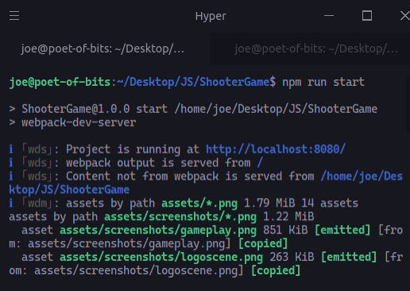

 

  

  <h2 align="center">Project: Shooter Game </h2>

  

    This project is part of the Microverse curriculum in JavaScript module!
  

## About The Project

This is a shooter game implemented using Phaser 3. The requirements were as follows

- You must implement a turn-based RPG game with **Phaser** library
- You must implement a **scoring system**, so that when the user completes a game they are given a score (number)
  - You should [use this service API](https://www.notion.so/microverse/Leaderboard-API-service-24c0c3c116974ac49488d4eb0267ade3) to save the score associated to the game and the user name, and display a leaderboard (as a Phaser scene)
- The game must be deployed to a server so that it was accessible online

## Game Design Document
The design description can be found [here](assets/docs/gamedesigndocument.md)

## Screenshots

## Live Link

[Zombie-Street](https://still-mountain-57347.herokuapp.com/)

<!-- INSTALLATION -->

## Installation

- Clone this repo `git clone https://github.com/Mindo-Joseph/ShooterGame.git`
- Open terminal `cd` to the cloned folder
- Checkout to the feature branch by `git checkout feature/shooter-game`
- Install dependencies by running `npm i` in your terminal
- Start the local server by using the following command `npm run start`
- Check your terminal to see what port webpack-dev-server is working from, for example
  

- Based on the image above I should navigate to the site http://localhost:8080/ to play the game.

## How To Play

- Left joystick for movement.

- Right joystick to aim and fire.
- 
**If any of the joysticks seem unresponsive reload the page**

## How to run tests

- Run the command `npm run test`

### Built With

- Javascript
- Webpack
- Jest
- Phaser 3
- Heroku
- Express

## Author

👤 **Joseph Mindo**

- Github: [@MindoJoseph](https://github.com/Mindo-Joseph)
- Twitter: [@mindoJoseph](https://twitter.com/mindoJoseph)
- Linkedin: [Joseph Mindo](https://www.linkedin.com/in/josephmindo/)

## 🤝 Contributing

Contributions, issues and feature requests are welcome!

Feel free to check the [issues page](https://github.com/Mindo-Joseph/ShooterGame/issues).

## Acknowledgments

- [Microverse](https://www.microverse.org/)

## 📝 License

This project is [MIT](lic.url) licensed.

## Show your support

Give a ⭐️ if you like this project!
